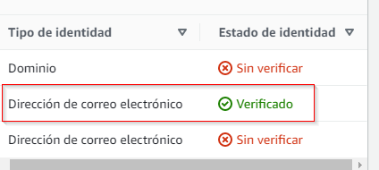
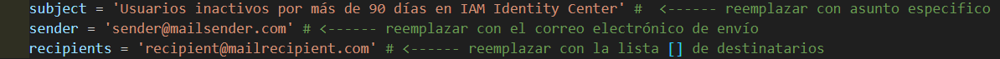

# WAR
# Implementar una política de ciclo de vida del acceso del usuario 

Este proyecto consiste en una lambda de AWS que envía notificaciones por correo electrónico de los usuarios IAM e IAM Identity Center inactivos durante más de 90 días.
La lambda utiliza SES (Amazon Simple Email Service) para enviar correos electrónicos con formato HTML en el cuerpo del mensaje.

## Tecnologías usadas:
* AWS Lambda
* AWS SES
___
## Configuración de SES

Configurar [SES](https://us-east-1.console.aws.amazon.com/ses/home?region=us-east-1#/homepage) para enviar correos electrónicos y verificar el dominio o las direcciones de correo electrónico que se utilizarán como remitentes.

1. Acceder a Identidades verificadas


2. Crear una nueva identidad y verificarla ingresando al email especificado hasta obtener el check de **verificado**



## Configuración de Lambda

### Ciclo de vida para usuarios en IAM

1. crear la funcion lambda (sugerido nombre *"LifeCicle-users-IAM..."*)
2. desde la configuración -> configuración general -> Editar:
	> Tiempo de espera: 15 segundos
	
3. desde la configuración -> Permisos -> Acceder al "Nombre del rol":
	>  Asociar política: **IAMReadOnlyAccess**
	
	> Asociar política -> Crear política -> Editar en formato JSON :
	```json
	{
	    "Version": "2012-10-17",
	    "Statement": [
	        {
	            "Effect": "Allow",
	            "Action": [
	                "ses:SendEmail",
	                "ses:SendRawEmail"
	            ],
	            "Resource": "*"
	        }
	    ]
	}
	```
	> Verificar el set de accesos y recursos de la política personalizada ->
	
	> Establecer nombre a la politica como *"LambdaSESPolicy"* por ejemplo.

4. Copiar el código del archivo ***LifeCicle-users-IAM-MailSender.py** al código de la función lambda.
5. Reemplazar los valores de las variables *"sender"* y *"recipients"*

|     VARIABLE     |	FUNCION 
|------------------|-------------------------------
|**`sender`**	   | lee el string del email registrado en SES. Este actuara para enviar el correo|
|**`recipients`**  | lee el string o lista del o de los emails registrados en SES. Este actuara para ser destinatarios de la notificación

> 

6.  Guardar y deployar la función.
7. Realizar el test mediante un evento vacío `{}`
8. verificar el resultado del test con conformidad `status: Succeeded`
	> dependiendo de la cantidad de usuarios encontrados y listados se puede obtener una respuesta del test irrelevante con el siguiente formato:
user sended 1
user sended 2
user sended 3
user sended 4
. . .

9. Esperar recibir el correo a *recipients* como se muestra a continuación para los usuarios IAM:
>  


### Ciclo de vida para usuarios en Identity Center (antes SSO)

1. crear la funcion lambda (sugerido nombre *"LifeCicle-users-IdentityCenter..."*)
2. desde la configuración -> configuración general -> Editar:
	> Tiempo de espera: 15 segundos
	
3. desde la configuración -> Permisos -> Acceder al "Nombre del rol":
	>  Asociar política: 
	> - **AWSSSODirectoryReadOnly** 
	> - **AWSCloudTrail_ReadOnlyAccess**
	
	> Asociar política -> Crear política -> Editar en formato JSON :
	```json
	{
	    "Version": "2012-10-17",
	    "Statement": [
	        {
	            "Effect": "Allow",
	            "Action": [
	                "ses:SendEmail",
	                "ses:SendRawEmail"
	            ],
	            "Resource": "*"
	        }
	    ]
	}
	```
	> Verificar el set de accesos y recursos de la política personalizada ->
	
	> Establecer nombre a la politica como *"LambdaSESPolicy"* por ejemplo.

4. Copiar el código del archivo ***LifeCicle-users-IdentityCenter-MailSender.py** al código de la función lambda.
5. Reemplazar los valores de las variables *"sender"* y *"recipients"*

|     VARIABLE     |	FUNCION 
|------------------|-------------------------------
|**`sender`**	   | lee el string del email registrado en SES. Este actuara para enviar el correo|
|**`recipients`**  | lee el string o lista del o de los emails registrados en SES. Este actuara para ser destinatarios de la notificación

> 

6.  Guardar y deployar la función.
7. Realizar el test mediante un evento vacío `{}`
8. verificar el resultado del test con conformidad `status: Succeeded`
	> dependiendo de la cantidad de usuarios encontrados y listados se puede obtener una respuesta del test irrelevante con el siguiente formato:
user sended 1
user sended 2
user sended 3
user sended 4
. . .

9. Esperar recibir el correo a *recipients* como se muestra a continuación para los usuarios Identity Center en:
>  

---
### *los scripts aún pueden ser optimizados...*
```
